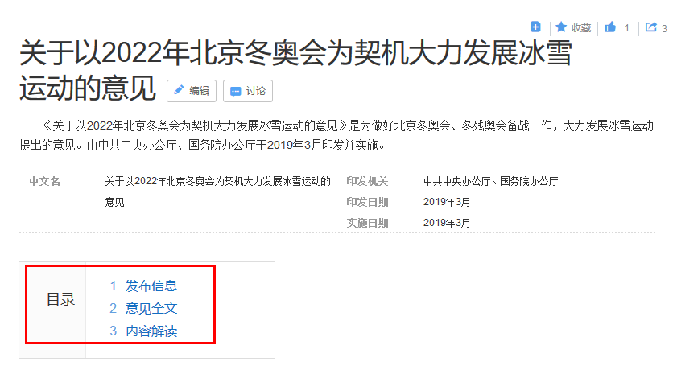

# 百度百科爬虫

## 1. 爬取所需url

设置开始词条的链接

```(Python)
class UrlSpider(CrawlSpider):
    name = 'url_spider'  # 用于区分不同的 spider，值唯一
    start_urls = ['https://baike.baidu.com/item/%E5%8C%97%E4%BA%AC/128981']  # 启动时进行爬取的url列表
    allowed_domains = ['baike.baidu.com']
    allowed_urls = ['https://baike.baidu.com/item/',]  # 允许的url列表为空，默认都爬取

```

使用xpath定位页面中所有的url，`//div[@class="para"]/a[@target="_blank"]/@href`适用于baike，其他网站可以类似自行尝试

```(Python)
    def _parse_response(self, response, callback, cb_kwargs, follow=True):
        itemld = ItemLoader(item=UrlItem(), response=response)
        itemld.add_xpath('view_urls', '//div[@class="para"]/a[@target="_blank"]/@href')  # xpath 定位每页中的链接位置
        return itemld.load_item()
```

`注`：这里没有使用链接提取器，因为我只想提取深度为1的url，不想一直跳到底，所以重写了`_parse_response`函数，注释掉了rules，还有一点要注意的是，虽然我把rules的follow参数设为False，它还会一直爬下去不会停止，如果有人知道原因可以email我

```
    # rules = (
    #     # 定义规则，使用链接提取器提取下一页链接
    #     Rule(LinkExtractor(allow='https://baike.baidu.com/item/', restrict_xpaths='//div[@class="para"]/a[@target="_blank"]/@href'),
    #          callback='get_view_urls', follow=False),
    # )
```

## 2. 对页面进行解析

这里参考了 @[Times125](https://github.com/Times125) 的实现，对词条的每个部分进行解析，得到所有的子标题和对应的内容，非常详细

```(Python)
    soup = BeautifulSoup(response.text, "html.parser")
    # 词条是否为多义词
    items['polysemous'] = '/view/10812277.htm' in response.text
    # 词条url
    items['original_url'] = unquote(response.url)
    # 词条名称
    name = soup.title.get_text()
    items['name'] = name.split('_百度百科')[0] if name else None
    # 百科解释
    summary = soup.find('div', attrs={'class': 'lemma-summary'})
    items['summary'] = re.sub(r'\r|\n', '', summary.get_text()) if summary else None
    # 词条来源
    items['source_site'] = '百度百科'
    # 词条被编辑次数
    desc_text = soup.find('dl', attrs={'class': 'side-box lemma-statistics'})
    edit_number = re.compile(r'编辑次数：([\d]+)次').findall(desc_text.get_text())[0] if desc_text else None
    items['edit_number'] = int(edit_number) if edit_number else 1
    # 词条最近更新时间
    latest = soup.find('span', attrs={'class': 'j-modified-time'})
    items['update_time'] = latest.get_text().replace('（', '').replace('）', '') if latest else None
    # 词条抓取时间
    items['fetch_time'] = datetime.now().strftime("%Y-%m-%d %H:%M:%S")
    # 词条的分类标签（路径）
    item_tag = soup.find('dd', attrs={'id': 'open-tag-item'})
    items['item_tag'] = re.sub(r'\r|\n|\s', '', item_tag.get_text()) if item_tag else None
    # 词条缩率图链接
    thumbnail_url = soup.find('div', attrs={'class': 'summary-pic'})

    ......

```

## 3. 爬取内容写入文件

效果如下所示，网页结果清晰可见

```
{"title": "关于以2022年北京冬奥会为契机大力发展冰雪运动的意见", 
 "paragraphs": 
    {"发布信息": "<p>近日，中共中央办公厅、......</p>", 
     "意见全文": "<p>关于以2022年北京冬奥会......</p>", 
     "内容解读": "<p>中共中央办公厅、国务院......</p>", 
     "参考资料": "<p>1.  中共中央办公厅 国......</p>", 
     "summary": "《关于以2022年北京冬奥会......"}}
```



## 参考
[Times125](https://github.com/Times125)：https://github.com/Times125/encyclopediaCrawler

[Tianyijian](https://github.com/Tianyijian)：https://github.com/Tianyijian/Spider